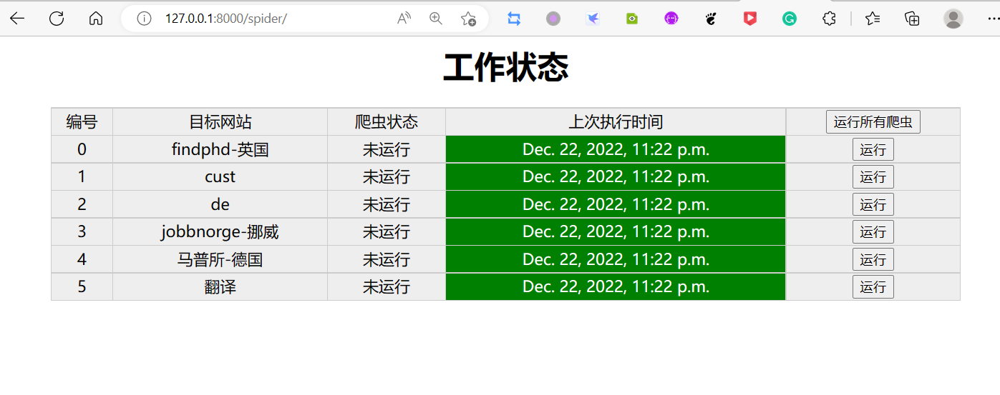
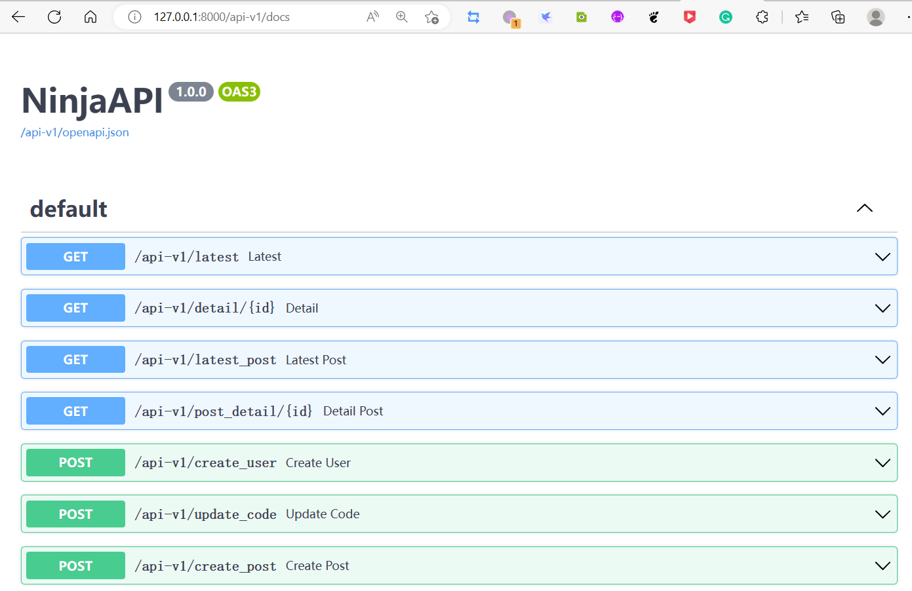
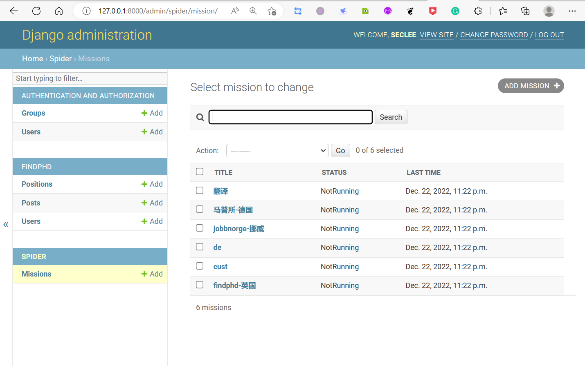
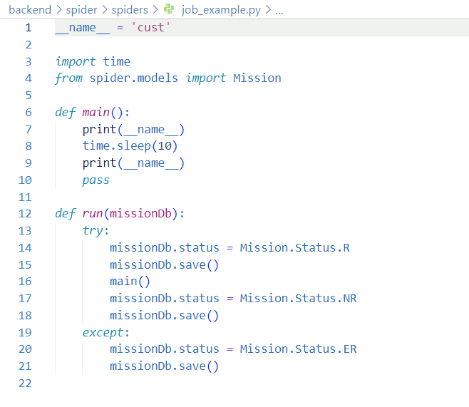

  <h1 align="center">
    Spider-api
  </h1>
  <h3 align="center">
     A web spider manager and base api app backend, based django Ninja
  </h3>

 
 

> 注意：这只是一个简单的起步项目，目的为了开发一个任务管理+内容管理后台和api的本地工具站，如果你的需求和这个项目不谋而合，可以把它当成是一个起步模板，在这个基础上进行开发。

## 介绍

基于django，Ninja开发的爬虫管理应用，附带提供restful api的基础后端服务。

- /findphd  :  restful api 服务应用，(Ninja开发)
    - / 提供了用户注册，邮箱验证，分页等api，开箱即用。
- /spider   :  任务管理模块
    - /spiders ： 存放要运行的所有任务
        - 项目随带了 示例文件，三个职位网站爬虫，一个调用google翻译api的翻译任务
        - 三个爬虫，一个是bs4的基础爬虫，两个是selenium的爬虫
- /ml       :  emmm，我搞忘了这个是啥app了，反正还没写，正好扩展你的需求。

## 演示

admin/
api-v1/
spider/

任务管理界面

  

Ninja提供的swager api页面

  

django自带的后台

  

## 使用

1. 克隆到本地：

` git clone https://github.com/derekwin/spider_api.git `

2. 建议你创建虚拟环境
- venv
- miniconda

此处不赘述，自行选择

安装依赖包：
` pip install -r requirements.txt `

3. 自带了sqlite3的一个数据库文件，有些基础数据

你也可以修改数据到你本地的数据库，参考django的官方文档

创建用户
` python manager.py createsuperuser 【username】 `

4. 启动项目

` python manager.py runserver `

配置注意：

- 如果需要，自行修改数据库配置

- 如果要使用邮箱验证，需要你在backend/setting.py最后配置你的服务邮箱

---

## 任务模块开发

按照job example的示例 在main函数实现模块的功能

  

具体怎么写参考其他四个任务

## 附：
- google翻译的那个库对应的api可能在中国大陆地区失效了
- 虽然一个很小的项目，但是可以很方便的扩展成一个内容管理后台，并且作为你前端的restful api服务。
- 本项目随附的两种爬虫是比较常见的python爬虫写法，无头浏览器爬虫基本所有网站都可以爬。
- 本项目没有提供任何代理或者反爬相关内容。
- 适合自己折腾定时任务，树莓派上来做一个内容维护的工具，不限于爬虫，hhh。

